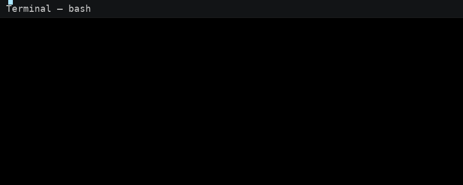

# Mini Port Scanner Using (Flask + Nmap)

[](https://example.com)
[](https://www.python.org/)
[](LICENSE)
[](https://github.com/)

## Objective
Scan open ports on a system to detect potential vulnerabilities.

## Tech Stack
- Python 3.8+
- Flask
- Nmap (system binary) + python-nmap
- Optional: Docker

## Features
- Detect open/closed ports (TCP)
- Identify basic running services / extra info (if Nmap available)
- Generate JSON scan reports (stored in `reports/`)
- Multi-threading for faster scans using ThreadPoolExecutor

## Setup
1. Install system nmap (Linux/macOS/Windows):
   - Debian/Ubuntu: `sudo apt-get install nmap`
   - Windows: install Nmap from https://nmap.org
2. Create virtualenv and install python deps:
   ```bash
   python -m venv venv
   source venv/bin/activate   # Windows: venv\Scripts\activate
   pip install -r requirements.txt
   ```
3. Run the Flask app:
   ```bash
   python app.py
   ```
4. Open `http://127.0.0.1:5000` in your browser.

5. Output
<p align="center">  </p>

## Security & Ethics
- Only scan hosts you own or have explicit permission to test.
- Unauthorized scanning may be illegal and unethical.

## Files
- scanner.py : core scanning logic
- app.py : Flask web UI and report endpoints
- templates/index.html : simple UI
- reports/ : saved JSON reports

---
## Conclusion
This Mini Port Scanner provides a lightweight, practical way to discover open TCP ports and gather basic service information — whether you need a quick local audit, a demo for learning, or a starting point for more advanced tooling. It combines fast socket-based checks with optional Nmap-powered enrichment, saves structured JSON reports for later analysis, and exposes a simple Flask UI and API for easy integration.

Feel free to extend the scanner (rate-limiting, async scanning, more Nmap scripts, or authentication-aware probes), open issues or PRs with improvements, and always remember to only scan targets you own or have explicit permission to test.
